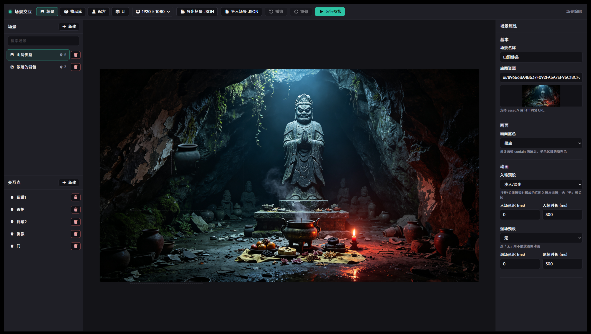
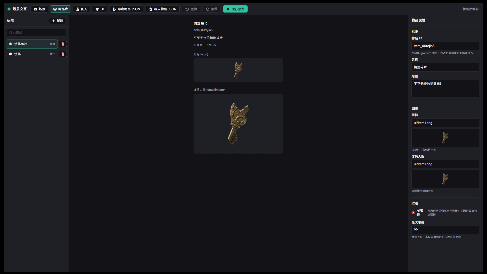
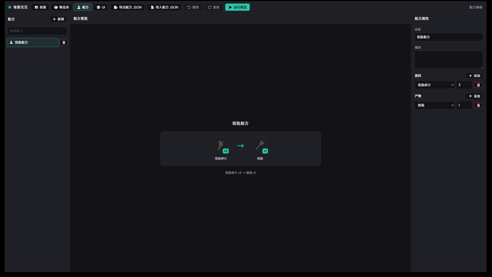
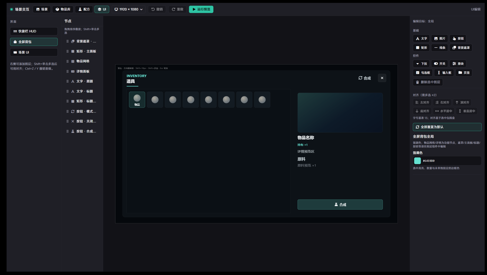
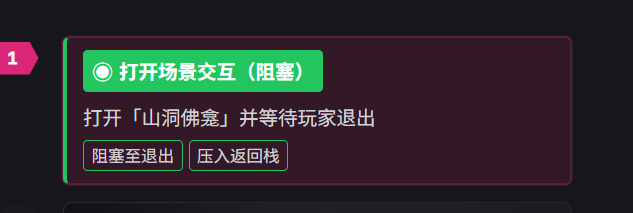

# LetsGal Studio 场景交互及物品栏系统

> 扩展包 ID：`ink.zenly.ext-27b96b`｜ 程序界面：`editor`、`scene-interaction`、`backpack-hud`、`backpack`  
> 扩展版本：`1.0.6` ｜ 需要 LetsGal Studio SDK：`>=1.9.2-beta`  
> 作者：池水三两升

这是一套**场景探索 + 物品栏**扩展：用内置编辑器配置多场景底图与交互点、物品库与合成配方；在剧情里打开场景、点击拿物品，并配合快捷栏与全屏背包。

本文只讲**作者怎么在 Studio 里用这个扩展**。

## 目录

1. [这个扩展能做什么](#1-这个扩展能做什么)
2. [五分钟跑通主流程](#2-五分钟跑通主流程)
3. [在编辑器里配置内容](#3-在编辑器里配置内容)
4. [在剧情里打开场景](#4-在剧情里打开场景)
5. [常用剧情方法](#5-常用剧情方法)
6. [快进时要注意什么](#6-快进时要注意什么)
7. [自检清单](#7-自检清单)
8. [更新说明](#8-更新说明)

## 1. 这个扩展能做什么

**可以：**

- 多场景底图 + 可点击交互点（可定制悬停光晕/缩放/滤镜、名称标签、一次性触发、可见性覆盖）
- 场景↔场景切换转场：淡入淡出（同时溶换）或覆盖覆入（可配合入场滑入/缩放）
- 沉浸式透明 letterbox（玩家运行时）；编辑器「运行预览」用不透明铺底，避免顶栏占高后透出 Studio 下层图
- 交互点动作链：跳转场景、给予/移除物品、合成、跳转片段、继续剧情等
- 物品库与合成配方（与场景同属「场景编辑器」）
- 左侧快捷栏 HUD + 全屏背包（查看大图、合成）
- 剧本方法打开场景交互（可阻塞剧情，直到玩家退出）
- 多段交互可各指定入口场景（写入本次交互主场景，不互相抢编辑器全局主场景）
- 玩家进度写入 slot：库存、场景进度、当前场景、本次主场景、返回栈

**要注意：**

- 扩展包 id 是 `ink.zenly.ext-27b96b`；调用方法时选子模块（如 `scene-interaction`）
- 库存存在 `scene-interaction` 的 `inventoryJson`；快捷栏与全屏背包共用同一份，不要另建第二套存档
- 请用**剧本 Preview**试玩；仅开扩展程序预览无法完整验证阻塞会话与写档
- 设计分辨率以编辑器顶栏为准（真源在 `editor`）；运行时会通过跨模块读取，请勿与工程分辨率混淆——两者同为 1280×720 时交互点也应与编辑器比例一致
- 剧本里的「场景 某某」是引擎场景节点；扩展场景在「场景编辑器」里配置，名称可以相同但不是同一套资源

## 2. 五分钟跑通主流程

按下面顺序做一遍，即可验证「配置 → 剧情打开 → 捡物品」。

```text
场景编辑器配场景 / 物品 / 配方
        ↓
剧情里「打开场景交互（阻塞）」并填写场景名称
        ↓
剧本 Preview：点交互点 → 快捷栏出现物品
```

更细的步骤见第 3、4 节配图说明。

## 3. 在编辑器里配置内容

在 Studio 中打开本扩展的 **场景编辑器**（程序 `editor`）。顶栏可切换：**场景交互 / 场景 / 物品库 / 配方 / UI**。

### 3.1 场景与交互点



1. 左侧 **场景** → **+ 新建**，起名（如「山洞佛龛」「散落的背包」）。
2. 右侧填 **底图资源**（支持工程内资源路径或 URL）。
3. 在场景属性里按需设置 **切换转场**（`淡入淡出` / `覆盖`）与入场动效；时长跟随该场景的入场 `durationMs`。
4. 需要时在场景行点 **「设为主」**：写入编辑器默认主场景（仅当方法**未填**场景名时作兜底）。当前主场景显示实心 **「主场景」** 标记。
5. 左侧 **交互点** → **+ 新建**（或画布上添加），把热区拖到底图上（如瓦罐、香炉、门）。
6. 选中交互点，在属性里配置动作链，例如：
   - `giveItem`：发放物品（填物品库里的物品 id）
   - `openScene`：切换到另一场景
   - `跳转片段（可跳回）`：播一段剧本片段后回到场景交互（桌面出包后若章节 id 失效会自动只按片段 id 跳转）
   - `once`：勾选后该点只触发一次
7. 交互点属性中的“显示条件”可按游戏变量设置全部/任一规则，支持真假、相等和数值比较；规则不满足时场景点隐藏。设计画布保留场景点便于继续编辑，运行预览与玩家画面按变量实时显隐。
8. 需要时可为交互点单独配置悬停效果、名称标签；也可在 **UI → 场景 UI** 里设全局预设，单点勾选「跟随全局」。

顶栏 **运行预览** 以左侧**当前选中/正在编辑的场景**为预览目标（不是固定编辑器主场景）。

需要时可用顶栏 **导出 / 导入场景 JSON** 备份或迁移。

### 3.2 物品库



1. 顶栏切到 **物品库** → **+ 新建**。
2. 填写 **物品 ID**（给 `giveItem` 用；改 id 后请同步改场景动作里的引用）、**名称**、**描述**。
3. 配置 **图标**（快捷栏 / 格子）与 **详情大图**（查看物品时）。
4. 按需勾选 **可堆叠** 并设置上限。

### 3.3 合成配方（可选）



1. 顶栏切到 **配方** → **+ 新建**。
2. **原料** 添加物品与数量（如钥匙碎片 ×3）。
3. **产物** 添加结果物品（如钥匙 ×1）。
4. 玩家可在全屏背包中合成；剧情也可用方法 `craft-recipe`。

### 3.4 自定义背包 / HUD 外观（可选）



1. 顶栏切到 **UI**。
2. 左侧选择界面：**全屏背包** / **快捷栏 HUD** / **场景 UI**。
3. **场景 UI** 可调：获得提示（含可选「获得音效 SE」，留空不播）、交互点悬停全局预设、名称标签样式、场景返回按钮等。
4. 在画布上调整节点位置、强调色等；改完后用 **运行预览** 快速看一眼布局。
5. 不需要玩家快捷栏时，在 **UI → 快捷栏 HUD** 关闭 **自动显示背包快捷栏**；场景交互将不再自动显示 HUD，剧本方法仍可手动打开。

不改 UI 也能用默认布局直接玩。

## 4. 在剧情里打开场景

### 4.1 调用「打开场景交互（阻塞）」



在玩家需要探索的那段剧情中加入：

**调用扩展方法 → 场景交互 → 打开场景交互（阻塞）**

| 参数 | 建议 |
| --- | --- |
| 场景 ID/名称 | **建议填写**扩展场景的 id 或名称（如 `散落的背包`）：打开该场景，并设为**本次交互主场景**。多段交互可各填不同名称。留空才回退：上次本次主场景 → 编辑器主场景 → 库中首项 |
| 压入返回栈 | 新开一段交互枢纽时常用 `false`（清空旧返回栈）；需要从上一场景返回时再开 |
| 返回目标（可选） | 压栈时覆盖返回目标 |

该方法会弹出场景界面并**卡住后续剧情**，直到玩家退出，或调用「关闭场景交互」。

填写名称 ≠ 修改编辑器「主场景」；编辑器主场景只作留空兜底。右侧 Studio 剧本场景预览（如引擎「场景 祠堂」）也不是扩展交互画面。

若只需切换场景、不阻塞剧情，改用 **打开场景**（`open-scene`）。

### 4.2 剧本 Preview 试玩


1. 使用 **剧本 Preview**（不是只开扩展预览）。
2. 播到「打开场景交互」后，应看到**方法参数指定的扩展场景**底图与交互点；左侧为快捷栏；右上角有退出。
3. 点击配置了 `giveItem` 的交互点，物品应出现在快捷栏。
4. 点击配置了 `openScene` 的交互点，应切换到目标扩展场景（可带动转场）。
5. 需要时打开全屏背包查看详情或合成。

调试时可在调试器 **内部 → 场景交互系统** 查看 `inventoryJson` / `currentSceneId` / `mainSceneId`。

## 5. 常用剧情方法

成功 / 失败结果可通过可选参数 **`resultVariable`** / **`targetVariable`** 写入剧本变量。

### 场景交互（`scene-interaction`）

| 方法 | 作用 |
| --- | --- |
| 打开场景交互（阻塞） | 显示场景并等待玩家退出（主流程推荐）；填写的场景即本次主场景 |
| 打开场景 | 显示场景，不阻塞剧情 |
| 关闭场景交互 | 关闭界面并解除阻塞 |
| 给予物品 / 是否持有 / 获取数量 | 读写库存 |
| 合成配方 | 按配方扣原料并发产物 |
| 设置交互点可见性 | 覆盖某交互点是否可见 |
| 获取当前场景 ID | 读出当前场景写入变量 |

### 背包

| 模块 | 方法 | 作用 |
| --- | --- | --- |
| `backpack-hud` | 打开 / 关闭背包 HUD | 控制快捷栏显示 |
| `backpack` | 打开 / 关闭全屏背包 | 控制全屏背包 |

打开场景交互后，运行时通常会自动叠快捷栏；也可在剧情里单独调用上述方法。

## 6. 快进时要注意什么

- **打开场景 / 打开场景交互 / 打开背包与 HUD**：快进时**不能跳过**，仍会进入完整界面（避免玩家略过必须交互的段落）。
- **关闭界面、给予物品、查询类方法**：快进时只落存档或结果，不再额外弹 UI。

## 7. 自检清单

- [ ] Studio 已加载本扩展，能打开「场景编辑器」
- [ ] 至少建好 1 个场景、1 个交互点、1 个物品，且交互点动作引用正确物品 id
- [ ] 剧本里「打开场景交互（阻塞）」填写了目标扩展场景名称或 id
- [ ] 剧本 Preview 中打开的是填写的扩展场景（不是编辑器主场景、也不是引擎剧本场景预览）
- [ ] 场景内 `openScene` 交互点能切到另一扩展场景
- [ ] 编辑器「运行预览」打开的是左侧当前选中场景；两侧无 Studio 下层图透出
- [ ] 点击给予物品后，快捷栏有图标，调试器 `inventoryJson` 有条目；若配置了获得 SE 应听到音效
- [ ] 交互点「跳转片段（可跳回）」能播对话并回到场景；桌面出包后章节 id 失效时仍能按片段跳转
- [ ] 全屏背包能看到同一份库存；关闭场景后剧情继续
- [ ] 设计分辨率与工程分辨率相同时（如均为 1280×720），剧本 Preview 里交互点大小与编辑器一致
- [ ] 多场景切换时转场平滑，无明显闪白或露底

## 8. 更新说明

- **1.0.6**：场景 UI「获得提示」可配置获得物品 SE（留空不播；场景给予与背包合成成功共用）；跳转片段带 `chapterId` 时若引擎报「章节不存在」，自动回退仅用 `fragmentId`（修复桌面出包后编辑器章节 id 对不上导致片段瞬间失败）。
- **1.0.5**：修复阻塞打开场景交互时，存档残留 `currentSceneId` 盖住方法填写目标（如填「散落的背包」仍显示「山洞佛龛」）；方法开场用 `openNonce` 强制覆盖并短暂锁定显示；返回按钮支持全局 + 方法级 `follow`/`show`/`hide` 覆盖。
- **1.0.4**：打开场景交互时填写的场景设为本次交互主场景（`mainSceneId`），多段交互互不抢编辑器全局主场景；叠层复用时 hide→show 并强制目标场景，避免仍显示旧主场景；编辑器运行预览以当前选中场景为准，预览用不透明铺底避免顶栏占高后透出下层图；修复开场强制 id 锁死导致场景内 `openScene` 不生效。
- **1.0.3**：场景切换支持淡入淡出（同时溶换）与覆盖覆入；预加载底图并按场景 id 稳定复用层，减轻闪一下；沉浸透明 letterbox；交互点悬停/名称标签可全局或单点定制；完善场景 UI、获得提示与奖励飞入等相关配置。
- **1.0.2**：修复运行时设计分辨率未从 `editor` 跨模块读取、回退默认 1920×1080，导致交互点相对底图缩小的问题。
- **1.0.1**：重写 README，聚焦作者用法，去掉构建流程等冗余说明，并配上编辑器 / 运行时截图。
- **1.0.0**：多模块拆分（编辑器 / 运行时 / HUD / 全屏背包）、阻塞会话、库存会话桥、打开类方法不可快进跳过。
