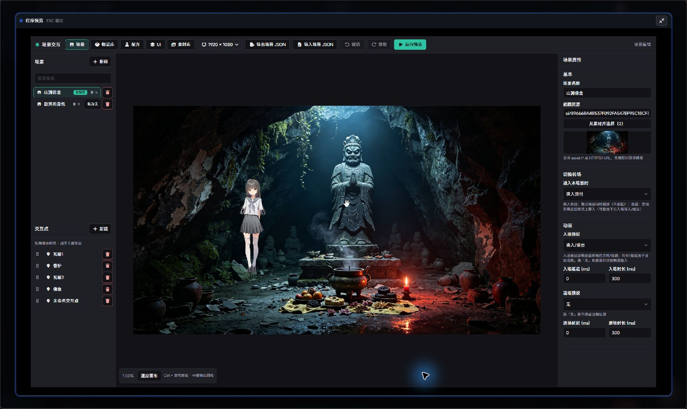
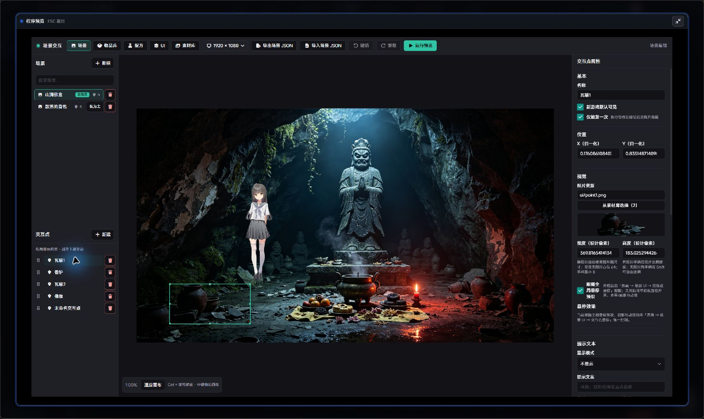
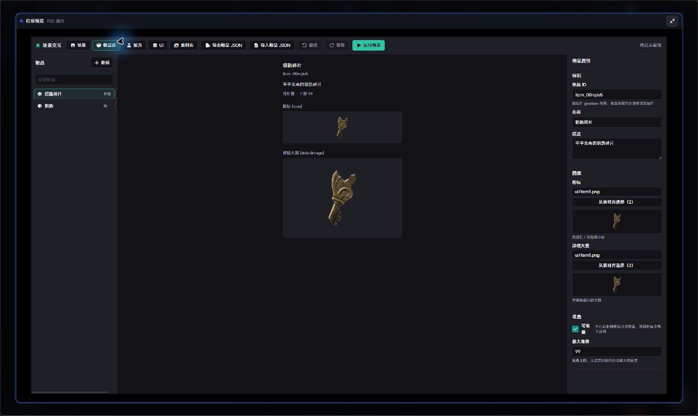
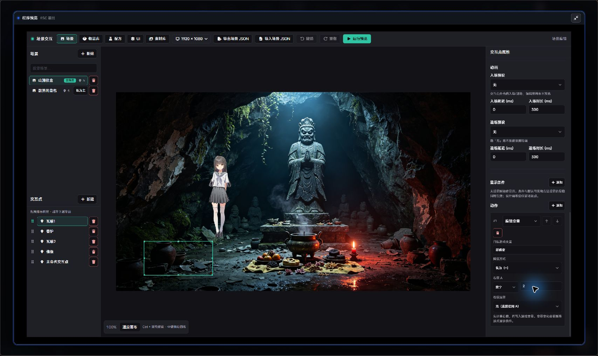
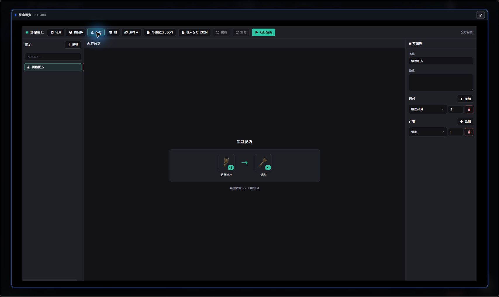

# 场景交互及物品栏系统

**版本 1.0.7** · 作者：池水三两升 · SDK：`>=1.9.9`

用内置编辑器制作多场景探索、点击拾取与物品合成，在剧本中直接调用。

## 功能

- 场景底图、交互点、转场与悬停效果。
- 统一图片资源选择器：Studio 工程图片分类、全局搜索、缩略图与键盘选择。
- 交互点显示条件与动作链，支持编辑变量 `=`、`+=`、`-=`、`*=`、`/=`。
- 物品库、合成配方、全屏背包与可关闭的快捷栏 HUD。
- Ctrl + 滚轮缩放画布，中键平移，交互点框体贴合图片尺寸。
- 玩家库存与场景进度随存档保存，兼容旧版图片资源引用。

按下方步骤完成一次“导入工程图片 → 制作场景与物品 → 配置动作 → 剧本调用 → 试玩”。编辑器截图来自 Studio 示例工程（部分为旧版，图片选择入口以本文为准），剧本调用与玩家画面沿用仓库示例图。

## 1. 打开编辑器

在 Studio **个性化** 中找到 **场景交互及物品栏系统**，打开程序 **场景编辑器**。顶栏提供 **场景 / 物品库 / 配方 / UI**。

## 2. 选择 Studio 工程图片

1. 在 Studio **资产** 页导入底图、交互点或物品图片。
2. 在插件的图片字段下点击 **选择资源**。底图、交互点、物品图标、详情大图与 UI 图片共用同一选择面板。
3. 在左侧按 **场景 / 立绘 / 界面 / 全部素材** 等分类浏览，或在顶部搜索。
4. 点击缩略图直接应用。点击 **取消** 或右上角 **×** 退出，不更改原图片。

- **搜索**：匹配文件名和路径，支持空格组合关键词，例如 `山洞 背景`；搜索覆盖全部分类。
- **刷新**：在 Studio 导入或调整图片后，点击 **刷新** 更新列表。
- **键盘**：聚焦图片后用方向键移动，Home / End 跳到首尾，Enter 应用。
- **预览**：显示缩略图、文件名与路径，当前图片高亮；支持 PNG、JPEG、WebP、GIF、SVG、AVIF 等格式。

图片统一由 Studio 工程管理，无需连接扩展源目录。若没有图片或提示清单不存在，先在 Studio 资产页导入图片或重新扫描，再回到选择面板刷新。

### 引用素材库与打包

编辑器会自动登记场景、物品和 UI 中使用的工程图片与音效，随工程扩展设置保存。换图或删除配置后自动更新，供 Studio 统计引用并按资源策略打包；Studio 的 **强制排除** 设置仍优先。

旧工程升级后，先打开一次场景编辑器完成同步。引用登记不写入扩展源目录，不会触发插件热更；日常图片导入和管理都在 Studio 资产页完成。

### 旧版兼容

图片字段仍可手动填写工程路径（如 `ui/room.png`）、`asset://…` 或图片 URL。外部 URL 不进入工程引用清单。

旧版 `extension-resource://assets/materials/…` 引用继续可用，不会自动复制或改写。保留原扩展图片文件，或通过 **选择资源** 更换为 Studio 工程图片。

## 3. 制作场景与交互点

1. 切到 **场景**，在左侧场景列表点 **+ 新建**，填写名称，例如“山洞佛龛”。
2. 在右侧 **底图资源 → 选择资源** 选背景，**底图展示** 可选完整显示或裁剪填充；旧场景默认完整显示。可按需设置切换转场和入场动画。
3. 在左侧交互点列表点 **+ 新建**，选中后填写名称，设置图片资源。
4. 拖动交互点到目标位置，拖动框体手柄调整大小；右侧也可输入宽高比例与坐标。宽高相对底图内容区计算，没有底图时相对设计画幅计算。
5. 需要一次性拾取时，勾选 **仅触发一次**。

选择或更换图片后，框体按图片原尺寸与比例显示。图片自身的透明留白仍计入尺寸；旧版像素尺寸在底图和交互点图片加载后换算为比例，保持迁移时的显示大小。无图片交互点可设置颜色、透明度和正方形或圆形。未选中的交互点不显示虚线框。

### 精细对齐

| 操作 | 效果 |
| --- | --- |
| Ctrl + 滚轮 | 围绕鼠标缩放整个画布，范围 25%～800% |
| 中键拖动 | 平移画布 |
| 适应画布 | 恢复居中与适应视图 |
| 选中后按方向键 | 微调交互点位置 |

底图、交互点与编辑框会一起缩放。视图缩放不改场景坐标和图片尺寸；切换场景或设计分辨率时恢复适应视图。100% 表示适应编辑器中栏。

场景行的 **设为主** 设置编辑器默认主场景；剧本方法填写了场景 ID 或名称时，使用方法指定的场景。

## 4. 新建物品

切到 **物品库 → + 新建**，配置以下内容：

| 字段 | 用途 |
| --- | --- |
| 物品 ID | 动作与剧本方法引用物品，须保持一致 |
| 名称、描述 | 玩家背包中的说明 |
| 图标 | 快捷栏与背包格子中的图片 |
| 详情大图 | 查看物品详情时展示 |
| 可堆叠、上限 | 控制同类物品数量 |

图标和详情图均可 **选择资源**。示例创建“钥匙碎片”和“钥匙”；修改物品 ID 后，应同步更新动作引用。

## 5. 给交互点添加动作与显示条件

回到 **场景**，选择交互点，向下滚动右侧属性到 **动作**，点 **+ 添加**。点击交互点时，按列表顺序执行动作，可用上下按钮调整顺序。

| 目的 | 配置方法 |
| --- | --- |
| 点击拾取 | 选 **给予物品**，选择“钥匙碎片”，数量填 1；一次性拾取勾选 **仅触发一次** |
| 点击切换场景 | 选 **打开场景**，选择目标场景；按需设置返回栈 |
| 修改游戏变量 | 选 **编辑变量**，填写目标变量及赋值方式 |
| 播放对话后回到场景 | 选 **跳转片段（可跳回）**，选择剧本片段 |
| 结束探索并接续剧情 | 选 **继续剧情** |

图中示例将“好感度”赋值为 2。若要每次增加 2，把 **赋值方式** 改为 `+=`；减少用 `-=`，乘除用 `*=`、`/=`。右值可选数字、文本、布尔值或游戏变量，也可先用 `+`、`-`、`*`、`/` 计算两个右值。

使用前在 Studio 配置对应游戏变量。减、乘、除要求数字类型，除数不能为 0。

### 完成其他交互点后显示

勾选 **其他交互点完成后显示** 后，同场景其他普通交互点须各完成一次未中断的动作链，此点才显示；同样勾选此设置的点不互为前置。完成记录随存档保存，并与默认可见、显隐覆盖及游戏变量条件共同生效。

### 按变量决定是否显示

在 **显示条件 → + 添加** 中填写游戏变量名、类型、判断与比较值。例如：

- 变量 `已解锁`，类型 **布尔**，判断 **为真**：解锁后显示。
- 变量 `好感度`，类型 **数字**，判断 **大于等于**，比较值 `2`：达到要求后显示。

多条规则可选择 **全部满足** 或 **任一满足**；比较对象也可选另一个游戏变量。条件、默认可见及方法设置的显隐共同决定运行时显示，设计画布保留交互点便于编辑。

## 6. 配置合成与 HUD（可选）

### 合成配方

切到 **配方 → + 新建**，填写名称，分别添加原料与产物。例如 **钥匙碎片 ×3 → 钥匙 ×1**。玩家在全屏背包中合成，也可由剧本调用 **合成配方**。

### 快捷栏与界面

场景属性中的 **显示快捷栏** 和 **显示打开背包按钮** 可分别控制该场景的 HUD；旧场景默认均显示，编辑器预览与玩家界面同步应用。

在 **UI** 中选择 **全屏背包 / 快捷栏 HUD / 场景 UI**，调整布局、颜色、提示与悬停效果。

不需要玩家快捷栏时，在 **UI → 快捷栏 HUD** 关闭 **自动显示背包快捷栏**。进入场景不再自动显示快捷栏，物品飞入快捷栏动画也停用；剧本方法仍可手动打开 HUD。库存照常保存，全屏背包仍可使用。

## 7. 在剧本中打开场景

在探索开始的位置添加 **调用扩展方法 → 场景交互 → 打开场景交互（阻塞）**。

- **场景 ID/名称**：建议明确填写，例如“山洞佛龛”。该场景成为本次交互主场景。
- **压入返回栈**：开启新一段探索通常设为 `false`；需要保留上一场景返回关系时再开启。
- **返回目标**：压栈时可指定返回场景。

方法会等待玩家退出，或通过 **继续剧情 / 关闭场景交互** 解除阻塞，再执行后续剧本。只需显示界面、不等待玩家退出时，可选 **打开场景**。

多段探索分别填写各自入口场景。剧本中的引擎“场景”节点与本扩展的场景库分别配置。

## 8. 试玩与交付

先用编辑器顶栏 **运行预览** 检查当前选中场景、图片位置与界面布局。该预览使用独立沙箱。

再用 **剧本 Preview** 播放到扩展方法，依次检查：

- [ ] 打开的是方法指定的场景。
- [ ] 点击拾取后，快捷栏和全屏背包显示同一份库存。
- [ ] 变量动作会更新显示条件，一次性点不会重复发放物品。
- [ ] 场景切换、片段跳转后返回、配方合成正常。
- [ ] 退出场景后继续执行剧本，存档读档恢复玩家进度。

打开场景、背包及 HUD 的方法在快进时仍会显示界面；给予物品和查询类方法按快进规则落存档或结果。

**备份与迁移**：可导出场景、物品、配方 JSON；工程图片随 Studio 工程备份和打包，单独导出的 JSON 不包含图片。旧版 `extension-resource://assets/materials/…` 仍依赖原扩展图片文件，未更换前须一并保留。

## 1.0.7 更新

- 图片选择接入 Studio 工程资源，统一使用分类、全局搜索和缩略图选择面板。
- 自动维护引用素材库，供 Studio 识别资源引用并按策略打包，兼容旧版图片路径。
- 新增变量动作、交互点显示条件、HUD 开关与画布缩放。
- 统一编辑器 Chakra UI，修复弹层定位、场景列表溢出、画布误触及 HUD 清理时序。

[历史更新记录](docs/changelog.md) · 扩展 ID：`ink.zenly.ext-27b96b`
