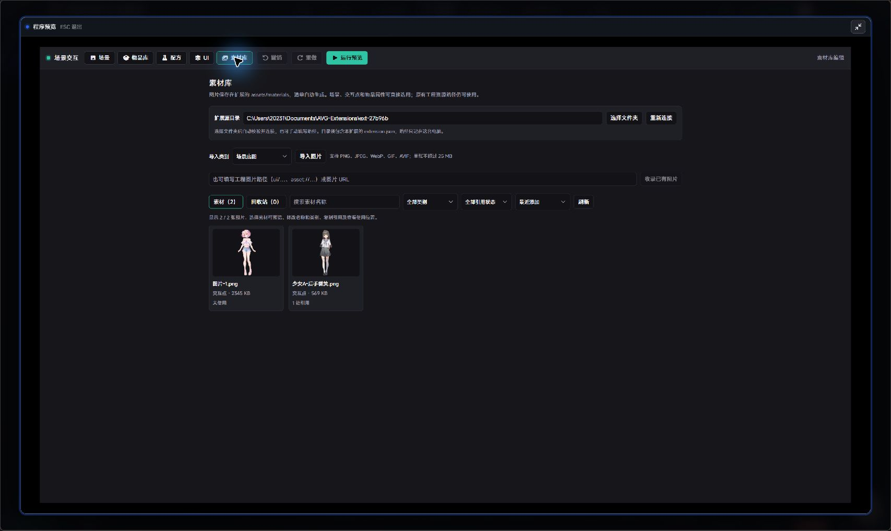
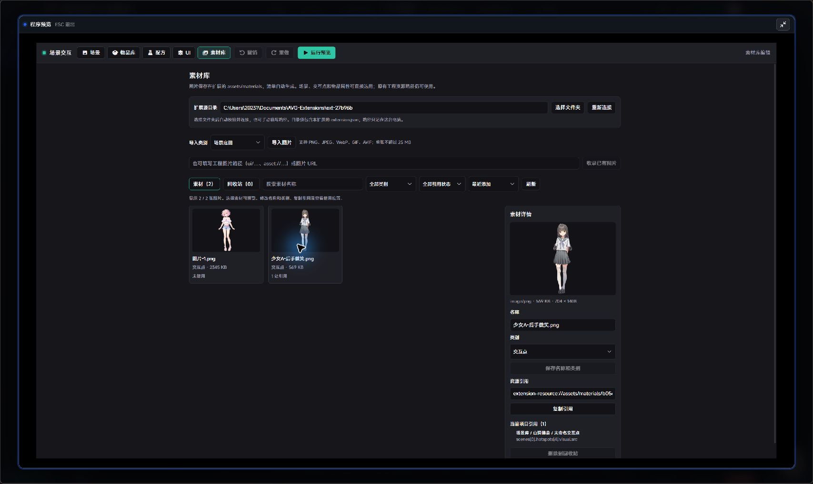

# 作者图文教程

适用版本：**1.0.7**。按“导入图片 → 制作场景 → 配置物品与动作 → 剧本调用 → 试玩”完成一次点击拾取。

编辑器截图来自当前 Studio 示例工程；剧本调用与玩家画面沿用仓库示例图。图片和名称仅作示例，可替换为自己的素材。

## 1. 打开编辑器

在 Studio **个性化** 中找到 **场景交互及物品栏系统**，打开程序 **场景编辑器**。顶栏提供 **场景 / 物品库 / 配方 / UI / 素材库**。

## 2. 导入图片到素材库

1. 切到 **素材库**，点击 **选择文件夹**，选择包含本扩展 `extension.json` 的目录。选择后会自动校验并连接。
2. 选择 **导入类别**：场景底图、交互点、物品或其他图片。
3. 点击 **导入图片**，可一次选择多张。支持 PNG、JPEG、WebP、GIF、AVIF，单张不超过 25 MB。
4. 回到场景或物品属性，在图片字段下点 **从素材库选择**，选择需要的图片。

已有工程图片可填写 `ui/…`、`asset://…` 或图片 URL，再点 **收录已有图片**。图片会复制到素材库，资源清单自动生成。旧版图片字段仍可直接使用原路径。

**目录连接只记录在本机。** 换电脑后重新连接当前扩展目录；Windows 桌面端可选择文件夹，不支持选择窗口的环境可手动填写绝对路径并点 **连接目录**。

### 管理素材

点击素材卡片查看像素尺寸、资源引用和当前项目使用位置。

- **名称和类别**：修改后点 **保存名称和类别**；已有资源引用保持不变。
- **查找**：按名称搜索，按类别或引用状态筛选，可按名称、添加时间、文件大小排序。
- **删除**：解除当前项目引用后，点 **删除到回收站 → 确认移入**。
- **恢复**：切到 **回收站**，选择图片后点 **恢复素材**。
- **刷新**：重新读取资源清单和当前项目引用。

回收站保留图片文件，不释放磁盘空间。引用检查限于当前项目本插件的设置，不覆盖其他工程或单独导出的 JSON；引用读取失败时禁用删除。

## 3. 制作场景与交互点

1. 切到 **场景**，在左侧场景列表点 **+ 新建**，填写名称，例如“山洞佛龛”。
2. 在右侧 **底图资源 → 从素材库选择** 选背景，可按需设置切换转场和入场动画。
3. 在左侧交互点列表点 **+ 新建**，选中后填写名称，设置图片资源。
4. 拖动交互点到目标位置，拖动框体手柄调整大小；右侧也可输入宽高与坐标。
5. 需要一次性拾取时，勾选 **仅触发一次**。

选择或更换图片后，框体按图片原尺寸与比例显示。图片自身的透明留白仍计入尺寸；旧版保存的尺寸继续保留。未选中的交互点不显示虚线框。

### 精细对齐

| 操作 | 效果 |
| --- | --- |
| Ctrl + 滚轮 | 围绕鼠标缩放整个画布，范围 25%～800% |
| 中键拖动 | 平移画布 |
| 适应画布 | 恢复居中与适应视图 |
| 选中后按方向键 | 微调交互点位置 |

底图、交互点与编辑框会一起缩放。视图缩放不改场景坐标和图片尺寸；切换场景或设计分辨率时恢复适应视图。100% 表示适应编辑器中栏。

场景行的 **设为主** 设置编辑器默认主场景；剧本方法填写了场景 ID 或名称时，使用方法指定的场景。

## 4. 新建物品

切到 **物品库 → + 新建**，配置以下内容：

| 字段 | 用途 |
| --- | --- |
| 物品 ID | 动作与剧本方法引用物品，须保持一致 |
| 名称、描述 | 玩家背包中的说明 |
| 图标 | 快捷栏与背包格子中的图片 |
| 详情大图 | 查看物品详情时展示 |
| 可堆叠、上限 | 控制同类物品数量 |

图标和详情图均可 **从素材库选择**。示例创建“钥匙碎片”和“钥匙”；修改物品 ID 后，应同步更新动作引用。

## 5. 给交互点添加动作与显示条件

回到 **场景**，选择交互点，向下滚动右侧属性到 **动作**，点 **+ 添加**。点击交互点时，按列表顺序执行动作，可用上下按钮调整顺序。

| 目的 | 配置方法 |
| --- | --- |
| 点击拾取 | 选 **给予物品**，选择“钥匙碎片”，数量填 1；一次性拾取勾选 **仅触发一次** |
| 点击切换场景 | 选 **打开场景**，选择目标场景；按需设置返回栈 |
| 修改游戏变量 | 选 **编辑变量**，填写目标变量及赋值方式 |
| 播放对话后回到场景 | 选 **跳转片段（可跳回）**，选择剧本片段 |
| 结束探索并接续剧情 | 选 **继续剧情** |

图中示例将“好感度”赋值为 2。若要每次增加 2，把 **赋值方式** 改为 `+=`；减少用 `-=`，乘除用 `*=`、`/=`。右值可选数字、文本、布尔值或游戏变量，也可先用 `+`、`-`、`*`、`/` 计算两个右值。

使用前在 Studio 配置对应游戏变量。减、乘、除要求数字类型，除数不能为 0。

### 按变量决定是否显示

在 **显示条件 → + 添加** 中填写游戏变量名、类型、判断与比较值。例如：

- 变量 `已解锁`，类型 **布尔**，判断 **为真**：解锁后显示。
- 变量 `好感度`，类型 **数字**，判断 **大于等于**，比较值 `2`：达到要求后显示。

多条规则可选择 **全部满足** 或 **任一满足**；比较对象也可选另一个游戏变量。条件、默认可见及方法设置的显隐共同决定运行时显示，设计画布保留交互点便于编辑。

## 6. 配置合成与 HUD（可选）

### 合成配方

切到 **配方 → + 新建**，填写名称，分别添加原料与产物。例如 **钥匙碎片 ×3 → 钥匙 ×1**。玩家在全屏背包中合成，也可由剧本调用 **合成配方**。

### 快捷栏与界面

在 **UI** 中选择 **全屏背包 / 快捷栏 HUD / 场景 UI**，调整布局、颜色、提示与悬停效果。

不需要玩家快捷栏时，在 **UI → 快捷栏 HUD** 关闭 **自动显示背包快捷栏**。进入场景不再自动显示快捷栏，物品飞入快捷栏动画也停用；剧本方法仍可手动打开 HUD。库存照常保存，全屏背包仍可使用。

## 7. 在剧本中打开场景

在探索开始的位置添加 **调用扩展方法 → 场景交互 → 打开场景交互（阻塞）**。

- **场景 ID/名称**：建议明确填写，例如“山洞佛龛”。该场景成为本次交互主场景。
- **压入返回栈**：开启新一段探索通常设为 `false`；需要保留上一场景返回关系时再开启。
- **返回目标**：压栈时可指定返回场景。

方法会等待玩家退出，或通过 **继续剧情 / 关闭场景交互** 解除阻塞，再执行后续剧本。只需显示界面、不等待玩家退出时，可选 **打开场景**。

多段探索分别填写各自入口场景。剧本中的引擎“场景”节点与本扩展的场景库分别配置。

## 8. 试玩与交付

先用编辑器顶栏 **运行预览** 检查当前选中场景、图片位置与界面布局。该预览使用独立沙箱。

再用 **剧本 Preview** 播放到扩展方法，依次检查：

- [ ] 打开的是方法指定的场景。
- [ ] 点击拾取后，快捷栏和全屏背包显示同一份库存。
- [ ] 变量动作会更新显示条件，一次性点不会重复发放物品。
- [ ] 场景切换、片段跳转后返回、配方合成正常。
- [ ] 退出场景后继续执行剧本，存档读档恢复玩家进度。

打开场景、背包及 HUD 的方法在快进时仍会显示界面；给予物品和查询类方法按快进规则落存档或结果。

**备份与迁移**：可导出场景、物品、配方 JSON；素材库图片及自动生成的 `assets/materials/manifest.json` 须随扩展一起交付，单独导出场景 JSON 不包含图片文件。

**已知问题**：源码关联模式下，导入图片可能触发 Studio 刷新插件界面并回到场景页。成功导入的图片仍在素材库中，返回 **素材库** 继续操作即可；本版本尚未修复刷新行为。

[返回 README](../README.md) · [更新记录](changelog.md)
